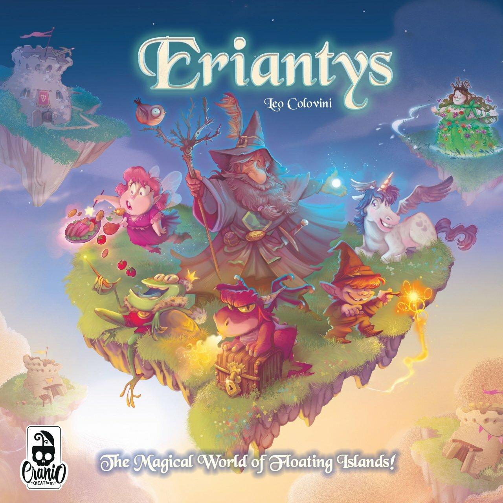
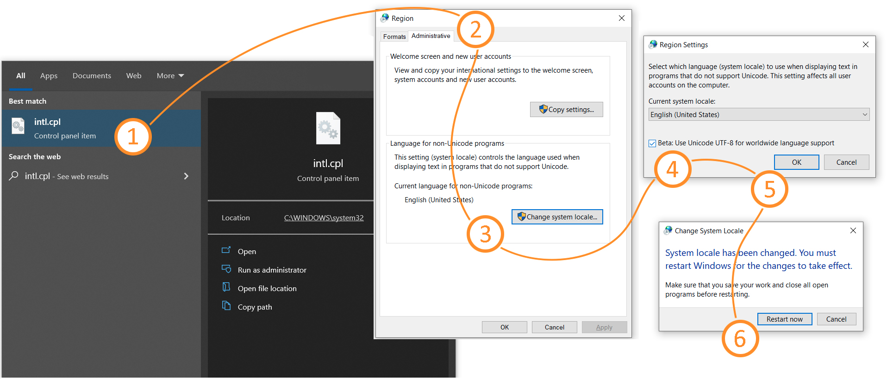

# Software Engineering Project A.A. 2021-2022



_Eriantys_ is the final test of **"Software Engineering"** course of **"Computer Science Engineering"** held at Politecnico di Milano (2021/2022).

**Professor**: Pierluigi San Pietro

**Group**: SP45


## UML
UML files have been made to document the progress of the project.

- [Initial UML](https://github.com/robertogiandomenico/ing-sw-2022-folini-grimaldi-giandomenico/blob/main/deliveries/Initial_UML.png): basic _model_ implementation made during the first _design_ phase;  
- Final UML(): complete generated UML to capture the whole structure of the implementation.

## Communication Protocol
The comunication protocol documentation has been redacted before the actual implementation and can be found [_here_](https://github.com/robertogiandomenico/ing-sw-2022-folini-grimaldi-giandomenico/blob/main/deliveries/UML/Sequence%20Diagram/Eriantys%20Protocol%20Documentation.md).

## Implemented features
| Functionality      |                                                                         Status                                                                          |
|:-------------------|:-------------------------------------------------------------------------------------------------------------------------------------------------------:|
| Basic rules        |           [✅](https://github.com/robertogiandomenico/ing-sw-2022-folini-grimaldi-giandomenico/tree/main/src/main/java/it/polimi/ingsw/model)            |
| Complete rules     |           [✅](https://github.com/robertogiandomenico/ing-sw-2022-folini-grimaldi-giandomenico/tree/main/src/main/java/it/polimi/ingsw/model)            |
| Socket             |          [✅](https://github.com/robertogiandomenico/ing-sw-2022-folini-grimaldi-giandomenico/tree/main/src/main/java/it/polimi/ingsw/network)           |
| CLI                |          [✅](https://github.com/robertogiandomenico/ing-sw-2022-folini-grimaldi-giandomenico/tree/main/src/main/java/it/polimi/ingsw/view/cli)          |
| GUI                |          [✅](https://github.com/robertogiandomenico/ing-sw-2022-folini-grimaldi-giandomenico/tree/main/src/main/java/it/polimi/ingsw/view/gui)          |
| 12 Character Cards |    [✅](https://github.com/robertogiandomenico/ing-sw-2022-folini-grimaldi-giandomenico/blob/main/src/main/java/it/polimi/ingsw/model/Game.java#L170)    |
| Multiple games     | [✅](https://github.com/robertogiandomenico/ing-sw-2022-folini-grimaldi-giandomenico/blob/main/src/main/java/it/polimi/ingsw/network/server/Server.java) |
| 4 players match    |                                                                            ⛔                                                                            |
| Persistence        |                                                                            ⛔                                                                            |
| Resilience         |                                                                            ⛔                                                                            |
#### Legend
⛔ Not Implemented &nbsp;&nbsp; ✅ Implemented

## Tools
| Tool                                                     | Description           |
|:---------------------------------------------------------|:----------------------|
| [IntelliJ IDEA Ultimate](https://www.jetbrains.com/idea) | IDE                   |
| [AstahUML](https://astah.net/products/astah-uml)         | UML Class Diagram     |
| [SequenceDiagram.org](https://sequencediagram.org)       | UML Sequence Diagram  |
| [Maven](https://maven.apache.org)                        | Dependency Management |
| [JUnit](https://junit.org/junit5)                        | Unit Testing          |
| [JavaFX](https://openjfx.io)                             | Graphical Library     |

## Testing
The JUnit tests cover 99.5% of the lines of the model. The few non-covered lines mainly deal with methods that have not been used in tests due to their random nature. Since tests must be implemented with deterministic methods, we opted to create new '_mock_' classes that have been used exclusively for this purpose.

## Jar
The jars are used to launch the software. A detailed guide on how to launch jar files is present in the next section. It is possible to find them at this link().

### Jar Execution
To launch the game is necessary to open the server first.

#### Windows
To give Windows users the best game experience it is recommended to use the Command Prompt with the latest _Windows Terminal_ version that can be found [here](https://apps.microsoft.com/store/detail/windows-terminal/9N0DX20HK701).\
It is also suggested enabling the UTF-8 characters support in the terminal, as following:
1. Open the _Region_ control panel by typing `intl.cpl` in the Windows search bar and press `Enter`
2. In the _Administrative_ tab, choose `Change system locale...` and check `Beta: Use Unicode UTF-8 for worldwide language support`
3. After pressing `OK` the system will ask to restart Windows for the changes to take effect
4. After the reboot the system will be fully ready to render special characters!


##### Server
The server can be run with the following command in a terminal window
 ```
java -jar Eriantys_Server.jar
 ```
Once the server is opened, it is asked to specify a port number or proceed with the default one (2807) by pressing `d`.\
Remember that the minimum number for a port is 1024 and the maximum is 65535.

##### Client
The client can be run with the one following command in a terminal window
###### For the GUI:
 ```
java -jar Eriantys_Client.jar
 ```
###### For the CLI:
 ```
java -jar Eriantys_Client.jar -cli
 ```

#### MacOS/Linux
##### Server
The server can be run with the following command in a terminal window
 ```
java -jar Eriantys_Server.jar
 ```
Once the server is opened, it is asked to specify a port number or proceed with the default one (2807) by pressing `d`.\
Remember that the minimum number for a port is 1024 and the maximum is 65535.

##### Client
The client can be run with the one following command in a terminal window
###### For the GUI:
 ```
java -jar Eriantys_Client.jar
 ```
###### For the CLI:
 ```
java -jar Eriantys_Client.jar -cli
 ```

## Team
- [Alessandro Folini](https://github.com/AlessandroFolini) - `alessandro.folini@mail.polimi.it`
- [Roberto Giandomenico](https://github.com/robertogiandomenico) - `roberto.giandomenico@mail.polimi.it`
- [Francesca Grimaldi](https://github.com/FrancescaGrimaldi) -`francesca1.grimaldi@mail.polimi.it`

## License
This project has been developed in collaboration with [Cranio Creations](http://www.craniocreations.it).

