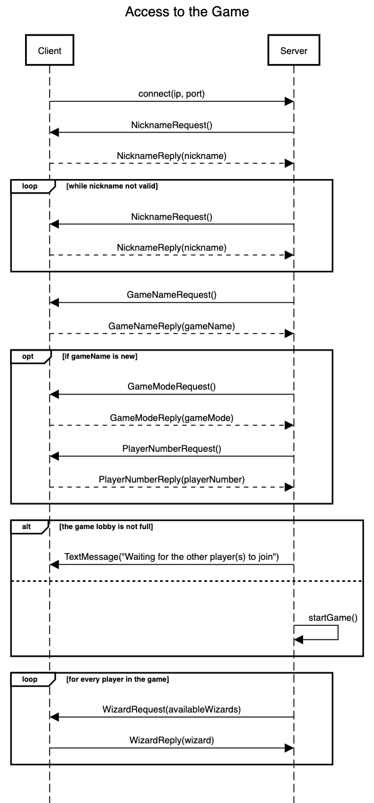
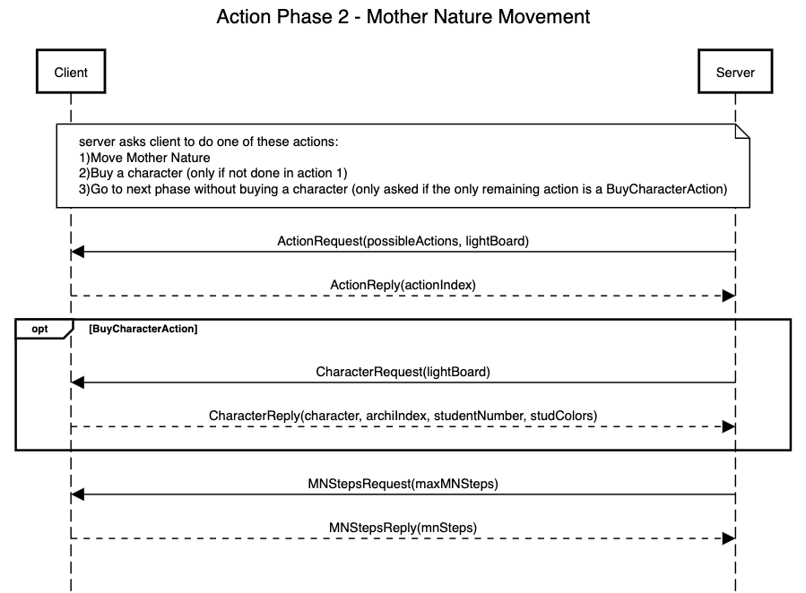
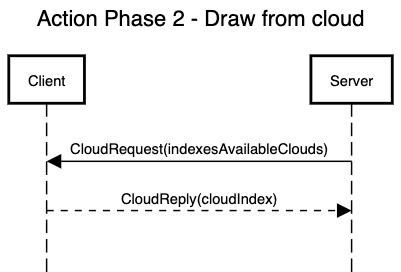

# Eryantis Protocol Documentation

Alessandro Folini, Francesca Grimaldi, Roberto Giandomenico

Group 45

## Messages

### NicknameRequest
Server asks the client for a valid nickname. It is used to uniquely identify the user.

#### Response
- NicknameReply(_nickname_).

### GameNameRequest
Server asks the client for a valid game name. It is used to uniquely identify a game.

#### Response
- GameNameReply(_gameName_).
  

### GameModeRequest
Server asks the client for the game mode they want to play.

#### Response
- GameModeReply(_mode_).  
  mode can be one of the two: **easy** or **expert**.

### NumPlayersRequest
Server asks the client for the number of players of the just created game.

#### Response
- NumPlayerReply(_num_).

### WizardRequest
Server asks the client to select one of the available wizards.

#### Arguments
- availableWizards: list of the available wizards.

#### Response
- WizardReply(_wizard_).

### PhaseEnteringMessage
Server communicates to the client the phase of the game about to start.

#### Arguments
- phase: specifies the phase of the game about to start (**planning**/**action**).

### StartTurnMessage
Server communicates to the current player's client that their turn has started.

### ChooseAssistantRequest
Server asks the client to select one of the available assistants.

#### Arguments
- availableAssistants: list of the available assistants.

#### Response
- ChooseAssistantReply(_assistant_).

### ActionRequest
Server asks the client to select one of the possible actions.

#### Arguments
- possibleActions: list of the possible actions.

#### Response
- ActionReply(_chosenAction_). 
  Depending on the current game phase, it can be one of the possible action type:  
  - `MOVE_STUDENT_ACTION`
  - `MOVE_MN_ACTION`
  - `BUY_CHARACTER_ACTION`

### SelectStudentRequest
Server asks the client to select one of the students to be moved.

#### Arguments
- availableColors: possible colors to be chosen. It is used to check whether the selected color is valid or not.

#### Response
- SelectStudentReply(_studentColor_).  
  _studentColor_ is the color of the chosen student.

### SelectPlaceRequest
Server asks the client to select the place where they want to move the student.

#### Response
- SelectPlaceReply(_place_).  
  _place_ is where the student will be moved.

### SelectCharacterRequest
Server asks the client to select one of three the available characters.

#### Arguments
- availableCharacter: possible character to be chosen.

#### Response
###### this reply contains all possible parameters that can be chosen, but only the necessary ones will be set by the user
- SelectCharacterReply(_character_,_archiIndex_,_studentNumber_,_studColors_).

### SelectMNStepsRequest
Server asks the client to select the number of steps mother nature will do.

#### Arguments
- maxMNSteps: maximum steps can do based on the selected assistant.

#### Response
- SelectMNStepsReply(_steps_).

### SelectCloudRequest
Server asks the client to select the cloud from which to take the students.

#### Arguments
- clouds: list of the available clouds.

#### Response
- SelectCloudReply(_cloud_).

### EndTurnMessage
Server communicates to the current player's client that their turn has ended.

### ResultMessage
Server communicates to the client their game result.

#### Arguments
- isWinner: boolean value that is `true` if the player is the winner or `false` in the opposite case.

## Scenarios

### Access to the game

1. Client accesses the server with IP address and server port;
2. once connection is established, server asks the client for their nickname until it is valid (not already taken and only alphanumeric characters);
3. server asks for the name of the game they want to join:
   1. if the name corresponds to that of one existing game, the client joins the lobby;
   2. otherwise a new game with that name is created. The server asks the game mode (**easy**/**expert**) and the number of players that will join;
4. once all the players joined, the game starts and asks every client, following the connection order, to select a wizard from the list of the available ones.

### Planning Phase

1. Server sends a message notifying the client that a phase (_planningPhase_) is about to start;
2. server notifies the current player that their turn starts now;
3. server asks the client to play an assistant card from their deck of available assistants. The server sends only the available assistants which have not already been chosen by the other players in this round.

### Action Phase 1: Students Movement

1. Server sends a message notifying the client that a phase (_actionPhase_) is about to start;
2. server asks the client to do one of the following actions:
   1. select a student from the entrance and, after the reply, the place (**archipelago**/**dining room**) where they want to put it;
   2. select a character from the available ones to use their special effect. This action may only be chosen once in the whole turn.
3. The operation 2 is repeated until three students from the entrance are moved.

### Action Phase 2: Mother Nature Movement

Server asks the client to do one of the following actions:
    1. select a character from the available ones to use their special effect, if not chosen during the action phase 1;
    2. select the number of steps mother nature will take between 1 and maxMNSteps.

### Action Phase 3: Draw from cloud

1. Server asks the client to choose a cloud from the list of the still full ones;
2. after the client reply, server notifies the client that their turn is over.

### End of the Game

When the winning conditions are met, server sends the clients their result. The message parameter will be `true` to the winner player, `false` to the others.
This message will also notify the client that the game is ending and the process will close.